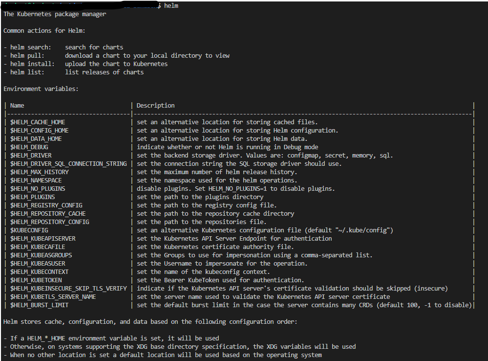
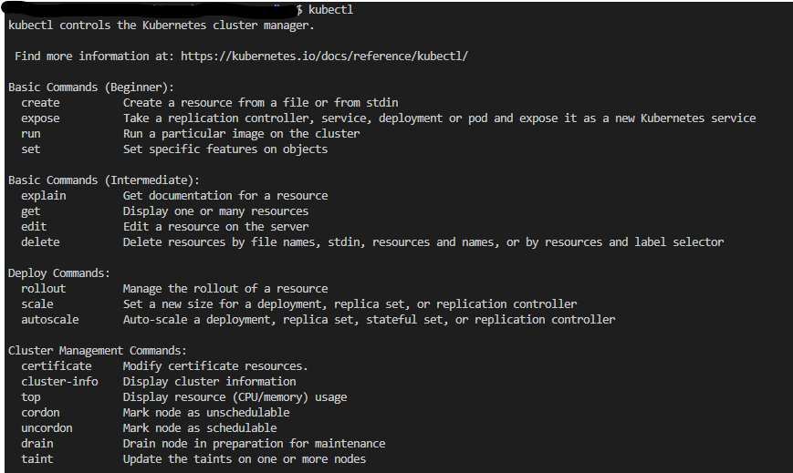
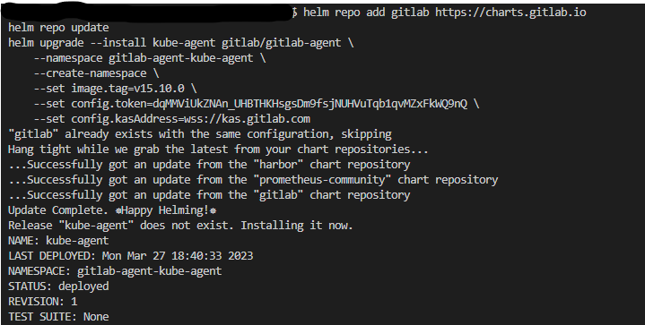
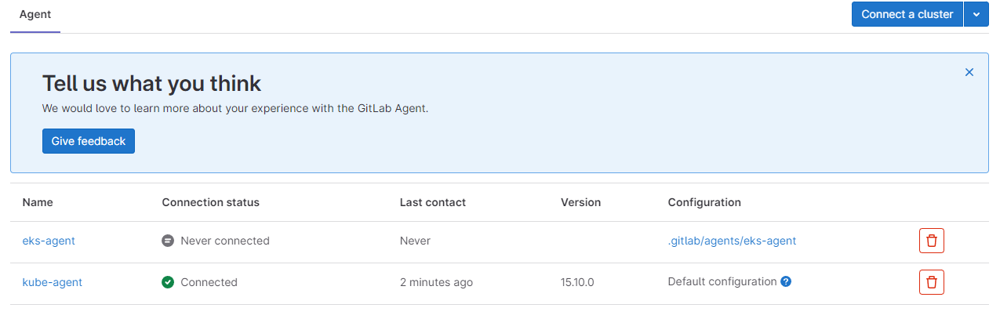

# CACI-sandbox vol 1.

This site and linked files are to serve the purpose of creating a kubernetes sandbox for developers. It also serves a secondary purpose of allowing developers to hone and sharpen their DevSecOp Skills. Each day new modules and projects could be added to help developers create solutions to issues they may face. Let's get started. 

## Install Helm
Steps are provided below and additional docs can be found on the [Helm](https://helm.sh/docs/intro/install/) site.

In your terminal type:
> $ curl -fsSL -o get_helm.sh https://raw.githubusercontent.com/helm/helm/main/scripts/get-helm-3  
> $ chmod 700 get_helm.sh  
> $ ./get_helm.sh  

Test the install by typing:
>> helm version  

The output should look similar to the following   
***version.BuildInfo{Version:"v3.11.0", GitCommit:"472c5736ab01133de504a826bd9ee12cbe4e7904", GitTreeState:"clean", GoVersion:"go1.18.10"}***  

There is a slightly more difficult way to install helm using GO and a working GOLANG environment ***NOTE: GO IS A PREREQUISITE FOR THIS WAY OF INSTALLATION***   
> $ git clone https://github.com/helm/helm.git  
> $ cd helm  
> $ make  

Test the install by typing:
>> helm version  

## Install Kubernetes
Next, after Helm has been installed, we can install Kubernetes (Kube). The order in which kube and helm are installed does not seem to matter. You'll want to follow the install instructions for [Kube on Linux](https://kubernetes.io/docs/tasks/tools/install-kubectl-linux/). It's important to note that once you follow the instructions under 'Install kubectl binary with curl on Linux' That you go to the section underneath the Red Hat Based Distributions and type that information into your terminal as well. 

### Launch your Cluster 

Coming Soon. . . 

## GitLab Runner
Once you have your cluster up and running, configure a Kubernetes GitLab Agent to connect your cluster to Git. From the Project menu in GitLab, go to infrastructure on the left hand side of the page. Once you click infrastructure, click kubernetes cluster, then click connect to a cluster. Type in an agent name, then click create. You'll see a modal box with information similar to the following:

> ### Agent Access Token
> dqMMViUkZNAn_UHBTHKHsgsDm9fsjNUHVuTqb1qvMZxFkWQ9nQ  

> ### Install Using helm
> helm repo add gitlab https://charts.gitlab.io  
> helm repo update  
> helm upgrade --install kube-agent gitlab/gitlab-agent \  
>    --namespace gitlab-agent-kube-agent \  
>    --create-namespace \  
>    --set image.tag=v15.10.0 \  
>    --set config.token=dqMMViUkZNAn_UHBTHKHsgsDm9fsjNUHVuTqb1qvMZxFkWQ9nQ \  
>    --set config.kasAddress=wss://kas.gitlab.com  

A successful agent-cluster connection should look similar to the following:  
  
  

#### Errors to work thru
A potential error may stem from not having the proper admin priveleges or not having correct certificates, it would look similar to:   

>> Error: looks like "https://charts.gitlab.io" is not a valid chart repository or cannot be reached: Get "https://charts.gitlab.io/index.yaml": x509: certificate is valid for abcd-caci.com, XX.FOO.BAR.AAA, XX.FOO.BAR.A12, XX.FOO.BAR.A13, XX.FOO.BAR.A14, XX.FOO.BAR.A15, XX.FOO.BAR.A16, XX.FOO.BAR.A17, XX.FOO.BAR.A18, not charts.gitlab.io

## DevOps the Hard way (not really)

We start by pulling code from here: [DevOps Quickstart Kubes](https://github.com/AdminTurnedDevOps/Kubernetes-Quickstart-Environments.git)
